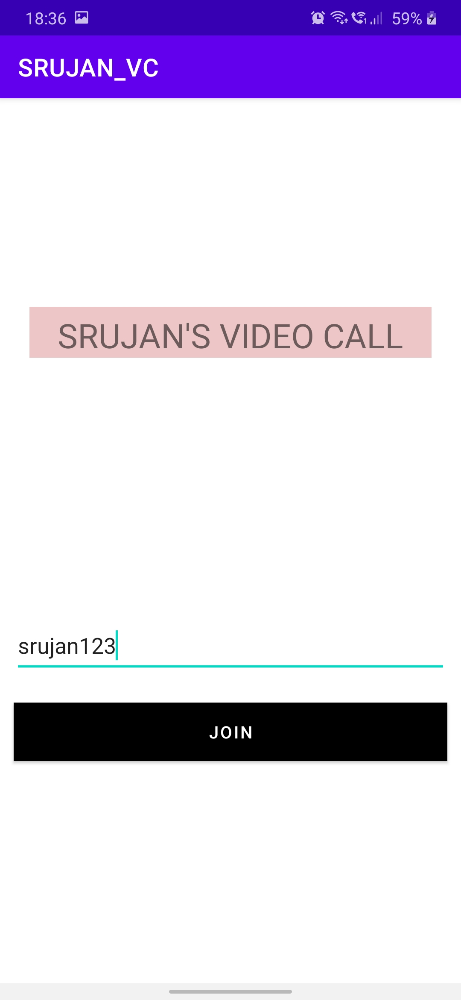
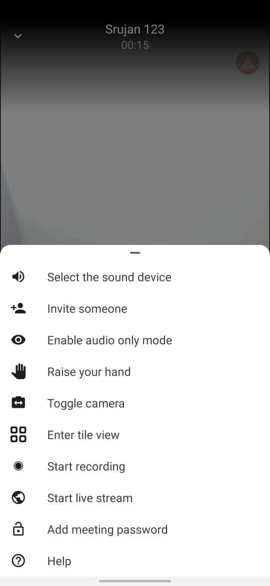

# SRUJAN_VC
This is a BASIC VERSION of video call android app. Where I have used the jisti meet handbook,as it is openSourse one. Here you can arrage video conference and have a private calls.
This application can be used by many members and in a meeting max of 75. they attend through app or web too. All the functionalities can be managed by the {https://jitsi.github.io/handbook/}

# APP_ICON

# FRONT_PAGE

# FEATURES

